## Platform Overview

Rotavision is built as a modular, cloud-native platform that integrates seamlessly with your existing ML infrastructure.


## Deployment Options

<CardGroup cols={2}>
  <Card title="Cloud (Managed)" icon="cloud">
    **Rotavision Cloud** is the fastest way to get started. We manage all infrastructure, scaling, and updates.

    - Multi-region availability (Mumbai, Singapore)
    - 99.9% SLA
    - SOC 2 Type II compliant
  </Card>
  <Card title="On-Premise / VPC" icon="server">
    **Rotavision Enterprise** can be deployed in your own infrastructure for maximum data control.

    - Kubernetes or VM deployment
    - Air-gapped environments supported
    - Custom compliance requirements
  </Card>
</CardGroup>

## Data Flow

### Synchronous Requests

For real-time operations (explanations, proxy requests):


### Asynchronous Jobs

For batch operations (fairness analysis, document extraction):


<Info>
  Async jobs return immediately with a `job_id`. Poll the status endpoint or configure webhooks for completion notifications.
</Info>

## Data Residency

All data processed by Rotavision Cloud is stored in India by default:

| Data Type | Storage Location | Retention |
|-----------|------------------|-----------|
| API Requests | Mumbai (AWS ap-south-1) | 90 days |
| Analysis Results | Mumbai (AWS ap-south-1) | Configurable |
| Model Artifacts | Customer-specified | Customer-managed |
| Logs & Metrics | Mumbai (AWS ap-south-1) | 30 days |

<Warning>
  If you use Sankalp to proxy requests to international LLM providers, your prompts may be processed outside India according to each provider's data policies.
</Warning>

## Security Architecture

```mermaid
flowchart LR
    subgraph Security["Security Layers"]
        direction TB
        T["🔒 Transport<br/>TLS 1.3, Certificate Pinning"]
        AN["🔑 Authentication<br/>API Keys, OAuth 2.0, SAML"]
        AZ["👤 Authorization<br/>Scoped Keys, RBAC, Policies"]
        D["💾 Data Protection<br/>AES-256 at rest, Field encryption"]
        N["🌐 Network<br/>VPC isolation, Private endpoints"]
        A["📋 Audit<br/>Immutable logs, SIEM integration"]
    end

    T --> AN --> AZ --> D --> N --> A

    style Security fill:#f8f9fa,stroke:#333
```




## Integration Patterns

### Direct Integration

Call Rotavision APIs directly from your application:

```python
# In your ML serving code
prediction = model.predict(features)
explanation = rotavision.vishwas.explain(model_id, features, prediction)
```

### Sidecar Pattern

Deploy Rotavision as a sidecar container for transparent monitoring:

```yaml
# Kubernetes deployment
containers:
  - name: ml-model
    image: your-model:v1
  - name: rotavision-sidecar
    image: rotavision/guardian-agent:latest
    env:
      - name: ROTAVISION_API_KEY
        valueFrom:
          secretKeyRef:
            name: rotavision-credentials
            key: api-key
```

### Event-Driven

Process events asynchronously via message queues:


## Product Integration Flow


## High Availability

Rotavision Cloud is designed for 99.9% availability:

- **Multi-AZ deployment** within Mumbai region
- **Automatic failover** for all stateful services
- **Circuit breakers** prevent cascade failures
- **Graceful degradation** maintains core functionality during partial outages


See our [Status Page](/status) for real-time availability.
